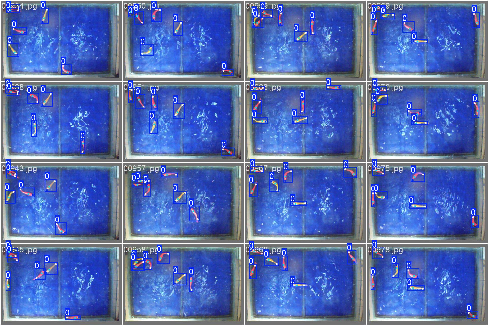
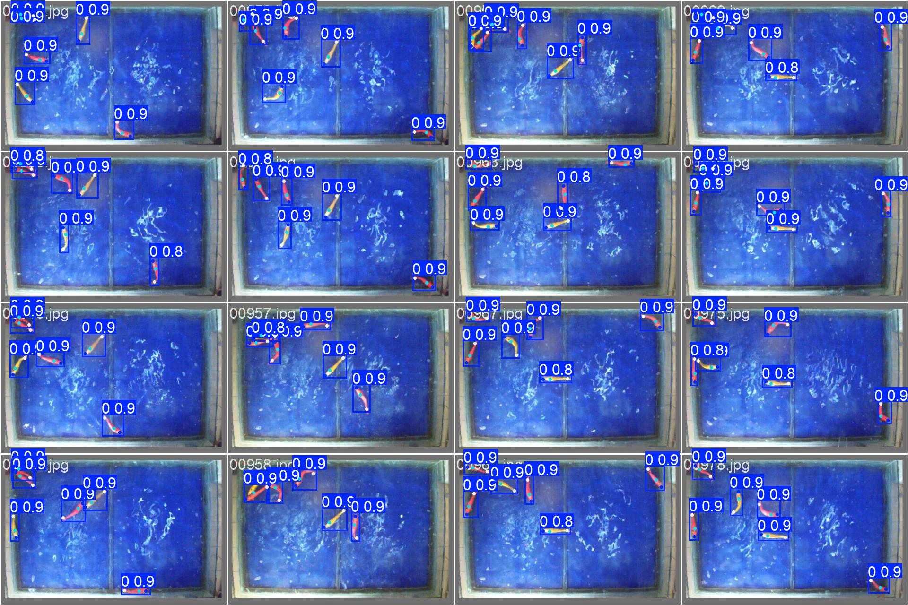

# Data Preparation and training YOLO pose estimation model
The dataset contains training and test data folders which includes both images and videos
In here i train the model using labeled images given in the source dataset
The annotations are given in the COCO format as a JSON file. for the YOLO training we need to convert these annotations to YOLO compatible format. In the following codes there are stepwise approach to do the data exploration and the annotation conversion as well as the train and validation splits

The data training was done from DTU HPC server GPU's

## DTU HPC 
```bibtex
@misc{DTU_DCC_resource,
    author    = {{DTU Computing Center}},
    title     = {{DTU Computing Center resources}},
    year      = {2024},
    publisher = {Technical University of Denmark},
    doi       = {10.48714/DTU.HPC.0001},
    url       = {https://doi.org/10.48714/DTU.HPC.0001},
}
```

loading the annotation file
```python
from pycocotools.coco import COCO

annotation = path/trainImages.json"
coco = COCO(annotation)
```
Listing available categories
```python
categories = coco.loadCats(coco.getCatIds())
category_names = [cat["name"] for cat in categories]
print("Categories:", category_names)
```

Checking all image IDS (Optional)
```python
img_ids = coco.getImgIds()
print(img_ids)
#here the image ids are stored as strings not integers
```

confirming that the keys and image ids are in the same format
```python
print("Image IDs from annotations file:", image_ids[:5])
print("Keys in coco.imgs:", list(coco.imgs.keys())[:5])
```

Visualiziing a single image in the training dataset
```python
#cisualizing a single image
import os
import cv2
import matplotlib.pyplot as plt
from matplotlib.patches import Rectangle
%matplotlib inline

# Define the image folder
image_folder = path/training/labeledImages"

#image ids are in string format
image_id = image_ids[0]  # For example, "00089"
print("Using image ID:", image_id)

# Pass the image_id inside a list to ensure it's treated as a single element, 
#otherwise it gives an error and its assumed as an array of elements (0,0,0,8,9)
image_metadata = coco.loadImgs([image_id])[0]
image_path = os.path.join(image_folder, image_metadata["file_name"])

# Load image using OpenCV
image = cv2.imread(image_path)
if image is None:
    raise FileNotFoundError(f"Image not found at path: {image_path}")

# Convert image from BGR to RGB for matplotlib
image = cv2.cvtColor(image, cv2.COLOR_BGR2RGB)

# Display the image
plt.figure(figsize=(5, 5))
plt.imshow(image)
plt.axis()
plt.title(f"Image ID: {image_id}")
plt.show()

```

Visualizing the bounding box annotation and the keypoints
```python
#visualizing annootations for a traininig image
def visualize_annotations(image_id, coco):
    # Get annotation ids for the given image id by wrapping image_id in a list.
    ann_ids = coco.getAnnIds(imgIds=[image_id])
    annotations = coco.loadAnns(ann_ids)

    # Load image metadata by passing the image_id as a list and taking the first element.
    img_metadata = coco.loadImgs([image_id])[0]
    img_path = os.path.join(image_folder, img_metadata["file_name"])

    # Read the image using OpenCV
    img = cv2.imread(img_path)
    if img is None:
        raise FileNotFoundError(f"Image not found at path: {img_path}")
    img = cv2.cvtColor(img, cv2.COLOR_BGR2RGB)

    # Plot the image
    plt.figure(figsize=(8, 8))
    plt.imshow(img)
    plt.axis("off")

    # Draw bounding boxes and keypoints for each annotation
    for ann in annotations:
        bbox = ann.get("bbox")
        keypoints = ann.get("keypoints", [])

        # Draw the bounding box 
        if bbox is not None:
            x, y, w, h = bbox
            plt.gca().add_patch(Rectangle((x, y), w, h, fill=False, edgecolor='red', linewidth=2))

        # Draw keypoints if available
        if keypoints:
            # Iterate over keypoints in groups of 3 (x, y, visibility)
            for i in range(0, len(keypoints), 3):
                kp_x, kp_y, visibility = keypoints[i:i+3]
                if visibility > 0:
                    plt.scatter(kp_x, kp_y, c="blue", marker="o", s=40)

    plt.title(f"Image ID {image_id}")
    plt.show()

# Run visualization with a valid image ID (for example, image_ids[8])
visualize_annotations(image_ids[0], coco)


```


Converting COCO format to YOLO format
```python
import json
import os

# Load the COCO JSON annotation file
json_path = f"/work3/msam/robotfish/Dataset/training/trainImages.json"
output_dir = f"/work3/msam/robotfish/Dataset/training/yololabels"

os.makedirs(output_dir, exist_ok=True)

# Read COCO JSON file
with open(json_path, "r") as f:
    data = json.load(f)

# Store correct image sizes (IDs are strings)
image_sizes = {img["id"]: (img["width"], img["height"]) for img in data["images"]}

# Process each annotation
for annotation in data["annotations"]:
    image_id = str(annotation["image_id"])  # Ensure ID is string for lookup
    bbox = annotation["bbox"]
    keypoints = annotation.get("keypoints", [])
    category_id = annotation["category_id"] - 1  # Convert to 0-based indexing for YOLO

    # Get actual image size from JSON
    #width = 752, width = 480
    if image_id not in image_sizes:
        print(f"Warning: Image ID {image_id} not found in metadata. Skipping...")
        continue
    
    img_width, img_height = image_sizes[image_id] 

    # Convert COCO Bounding Box format [x_min, y_min, width, height] to YOLO format
    x_min, y_min, width, height = bbox
    x_center = (x_min + width / 2) / img_width
    y_center = (y_min + height / 2) / img_height
    width /= img_width
    height /= img_height

    # Normalize keypoints (x, y, visibility)
    normalized_keypoints = []
    for i in range(0, len(keypoints), 3):  # Each keypoint has (x, y, visibility)
        kp_x = keypoints[i] / img_width
        kp_y = keypoints[i + 1] / img_height
        visibility = keypoints[i + 2]
        normalized_keypoints.extend([kp_x, kp_y, visibility])

    # Create YOLO pose annotation string
    annotation_line = f"{category_id} {x_center:.6f} {y_center:.6f} {width:.6f} {height:.6f} " \
                      + " ".join([f"{kp:.6f}" for kp in normalized_keypoints]) + "\n"

    # Save to YOLO label file
    label_filename = os.path.join(output_dir, f"{image_id}.txt")
    with open(label_filename, "a") as label_file:
        label_file.write(annotation_line)

print("Converted", output_dir)
```


Train/ val split
```python
import os
import shutil
import random

# Define paths
dataset_path = path/training"
images_path = os.path.join(dataset_path, "labeledImages")
labels_path = os.path.join(dataset_path, "yololabels")

# Output paths
output_base = path/yolo_dataset"
train_images = os.path.join(output_base, "train", "images")
train_labels = os.path.join(output_base, "train", "labels")
val_images = os.path.join(output_base, "val", "images")
val_labels = os.path.join(output_base, "val", "labels")

# Create necessary directories
for path in [train_images, train_labels, val_images, val_labels]:
    try:
        os.makedirs(path, exist_ok=True)
        print(f"Created directory: {path}")
    except Exception as e:
        print(f"Error creating directory {path}: {e}")

# Get all image files
image_files = [f for f in os.listdir(images_path) if f.endswith(('.jpg', '.png', '.jpeg'))]

if not image_files:
    print("No image files found in the source folder!")
    exit()

random.shuffle(image_files)  # Shuffle for randomness

# Split 80% train, 20% validation
split_index = int(len(image_files) * 0.8)
train_files = image_files[:split_index]
val_files = image_files[split_index:]

# Function to move files
def move_files(file_list, source_folder, dest_folder, ext):
    for file in file_list:
        src = os.path.join(source_folder, file)
        dest = os.path.join(dest_folder, file)
        if os.path.exists(src):
            try:
                shutil.copy(src, dest)
                print(f"Copied {src} -> {dest}")
            except Exception as e:
                print(f"Error copying {src} to {dest}: {e}")
        else:
            print(f"File not found: {src}")

# Move train images and labels
move_files(train_files, images_path, train_images, '.jpg')
move_files([f.rsplit('.', 1)[0] + '.txt' for f in train_files], labels_path, train_labels, '.txt')

# Move validation images and labels
move_files(val_files, images_path, val_images, '.jpg')
move_files([f.rsplit('.', 1)[0] + '.txt' for f in val_files], labels_path, val_labels, '.txt')

print("split successfull")
print(f"Train images: {len(train_files)}")
print(f"Validation images: {len(val_files)}")
```

Make a configuration .yaml file to indicate the relative paths for the train and val datasets and the class id, and keypoint details
Find the yaml file at the repository

```yaml
train: train/images    # Training images folder 📸
val: val/images        # Validation images folder 🧐
test: test/images      # Test images folder ✅

nc: 1                  # Number of classes (1 class) 🔢
names: ['0']           # Class names (here, a single class labeled '0') 🏷️

kpt_shape: [3, 3]      # Keypoint shape (e.g., 3 keypoints each with 3 attributes) 🔑
```
YOLO training
In this example the training was done using the nano architecture of the YOLO 11 pose estimation model. Do as you prefer.
```python
from ultralytics import YOLO  # Import once
import os
import pandas as pd
import torch

# Load the pose model weights.
# Make sure that "yolo11n-pose.pt" is available in the current working directory or provide its full path.
model = YOLO("yolo11n-pose.pt")

# Define dataset path and output directory
data_path = path/yolo_dataset/dataset_yolo.yaml"
output_dir = path/yolo_dataset/results"
os.makedirs(output_dir, exist_ok=True)

# Define training parameters
epochs = 300  # Fine-tuning epochs
learning_rate = 0.001  # Learning rate
batch_size = 32  # Batch size
img_size = 640  # Image size
optimizer = "Adam"


# Define output folder for this configuration
config_name = f"finetune_epoch{epochs}_batch{batch_size}_lr{learning_rate}"
config_output_dir = os.path.join(output_dir, config_name)
os.makedirs(config_output_dir, exist_ok=True)

# Train the model
print(f"Fine-tuning model with epochs={epochs}, lr={learning_rate}, batch={batch_size}, img_size={img_size}")
try:
    model.train(
        data=data_path,
        epochs=epochs,
        imgsz=img_size,
        device=0,  
        batch=batch_size,
        lr0=learning_rate,
        optimizer = optimizer,
        project=config_output_dir,  # Save results in this directory
        name="finetune_results"
    )
    print(f"Fine-tuning completed. Extracting validation metrics...")
except Exception as e:
    print(f"Training failed: {e}")
    exit()

# Validate the model and extract results
results = model.val(
    data=data_path,
    imgsz=img_size,
    save_json=True,  # Save predictions in COCO-JSON format
    save_conf=True,  # Save confidence scores
    conf=0.5,  # Confidence threshold
    save=True  # Save predictions
)

# Extract metrics
metrics = {
    "precision": results.box.mp,  # Mean precision
    "recall": results.box.mr,  # Mean recall
    "mAP50": results.box.map50,  # mAP at IoU=0.50
    "mAP50-95": results.box.map  # mAP at IoU=0.50-0.95
}

# Save metrics to CSV
metrics_df = pd.DataFrame([metrics])
metrics_csv_path = os.path.join(config_output_dir, 'metrics.csv')
metrics_df.to_csv(metrics_csv_path, index=False)
print(f"Metrics saved to {metrics_csv_path}")

# Extract confusion matrix
confusion_matrix = results.confusion_matrix

# Convert confusion matrix to a DataFrame and save if available
if hasattr(confusion_matrix, 'matrix'):
    cm_data = confusion_matrix.matrix
    cm_df = pd.DataFrame(cm_data)
    cm_csv_path = os.path.join(config_output_dir, 'confusion_matrix.csv')
    cm_df.to_csv(cm_csv_path, index=False)
    print(f"Confusion matrix saved to {cm_csv_path}")
else:
    print("Warning: Confusion matrix is not in the expected format. Skipping saving.")

# Free GPU memory
del model
torch.cuda.empty_cache()

print(f"All results and metrics saved in {config_output_dir}.")
```

# Validation Results 
<p align="center">
  
  
</p>

<p align="center">
  <b>Val Labels</b> &nbsp;&nbsp;&nbsp;&nbsp;&nbsp;&nbsp;&nbsp;&nbsp;&nbsp;&nbsp;
  <b>Val Predictions</b>
</p>

# Testing on new video of the multiple robot fishes swimming
```python
from ultralytics import YOLO
import torch
import os

# Set the trained model path (update this to match your trained model location)
trained_model_path = "path/weights/best.pt"

# Load the trained model
model = YOLO(trained_model_path)

# Set the input test video path

test_video_path = "path/2.avi"

# Set output directory for results
output_video_path = "path/test2.mp4"

# Run inference on the test video
results = model.predict(
    source=test_video_path,  # Input video file
    save=True,               # Save output video with detections
    save_txt=True,           # Save detection results as text files
    save_conf=True,          # Save confidence scores
    device=0,                # Use GPU 
    conf=0.5,                # Confidence threshold
    imgsz=640,               # Image size
    show=False,              # Set to True to display live inference
    project=os.path.dirname(output_video_path),  # Directory to save results
    name=os.path.basename(output_video_path).split('.')[0]  # Folder name
)

print(f"video saved at: {output_video_path}")

# Free GPU memory
del model
torch.cuda.empty_cache()
```

# Object tracking with YOLO default tracker. You can try different tracking algorithms (eg - Bytetrack)


```python
from collections import defaultdict
import cv2
import numpy as np
from ultralytics import YOLO
import torch
import os

# Your custom trained pose esimtation model path
trained_model_path = "path/weights/best.pt"

# load the trained model
model = YOLO(trained_model_path)

# test video path and output path
video_path = "path/unlabeledVideos/1.avi"
output_video_path = "path/test4.mp4"

# Open the video file
cap = cv2.VideoCapture(video_path)

# Get video properties
fps = int(cap.get(cv2.CAP_PROP_FPS))
width = int(cap.get(cv2.CAP_PROP_FRAME_WIDTH))
height = int(cap.get(cv2.CAP_PROP_FRAME_HEIGHT))
total_frames = int(cap.get(cv2.CAP_PROP_FRAME_COUNT))  # Get total frames

# Check if video opened successfully
if not cap.isOpened():
    print("Error: Could not open video file.")
    exit()

print(f"Video opened: {video_path}, Total Frames: {total_frames}, FPS: {fps}")

# Define video writer to save the output
fourcc = cv2.VideoWriter_fourcc(*'mp4v')  # Codec for .mp4 format
out = cv2.VideoWriter(output_video_path, fourcc, fps, (width, height))

# Store the track history
track_history = defaultdict(lambda: [])

# Reduce GPU load - to prevent memory errors (or sudden crashes in kernal)
device = "cuda" if torch.cuda.is_available() else "cpu"
print(f"Using device: {device}")

frame_count = 0  # Track number of frames processed

# Run tracking
with torch.no_grad():  # Disable gradient calculations to save memory
    while cap.isOpened():
        # Read a frame from the video
        success, frame = cap.read()

        # Ensure video frame advances correctly
        frame_count += 1
        print(f"Processing frame {frame_count}/{total_frames}")  # Debug output

        if not success:
            print("End of video reached or error in frame reading.")
            break  # End of video

        # Run YOLOv11 tracking on the frame
        results = model.track(frame, persist=True, device=device, imgsz=416, conf=0.5)

        # Check if results exist
        if results and results[0] is not None:
            # Extract tracking info
            boxes = results[0].boxes.xywh.cpu().numpy()  # Get bounding boxes (x, y, w, h)
            track_ids = results[0].boxes.id  # Track IDs

            if track_ids is not None:  # If tracking IDs exist
                track_ids = track_ids.int().cpu().tolist()

                # Annotate frame with detection results
                annotated_frame = results[0].plot()

                # Draw tracking lines
                for box, track_id in zip(boxes, track_ids):
                    x, y, w, h = box  # Extract bounding box
                    center_x, center_y = int(x), int(y)  # Get center coordinates

                    # Store track history
                    track = track_history[track_id]
                    track.append((center_x, center_y))  # Store the center point of the fish
                    if len(track) > 10:  # Reduce track length to save memory
                        track.pop(0)

                    # Convert tracking points to a polyline
                    points = np.array(track, dtype=np.int32).reshape((-1, 1, 2))
                    cv2.polylines(annotated_frame, [points], isClosed=False, color=(0, 255, 255), thickness=2)

                # Write the frame to the output video
                out.write(annotated_frame)


        # **Clear memory after every frame to prevent memory leak**
        del results
        torch.cuda.empty_cache()

# Release resources
cap.release()
out.release()
cv2.destroyAllWindows()
```
